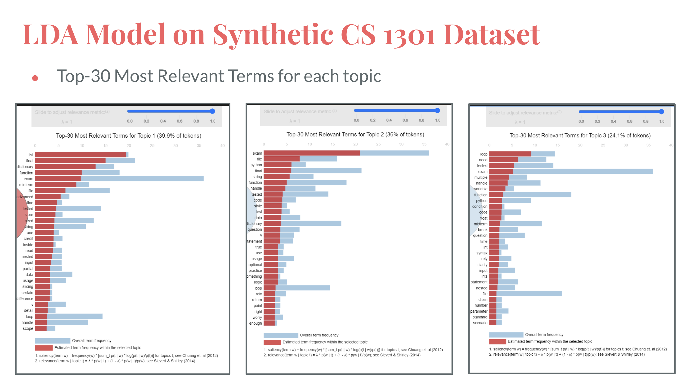
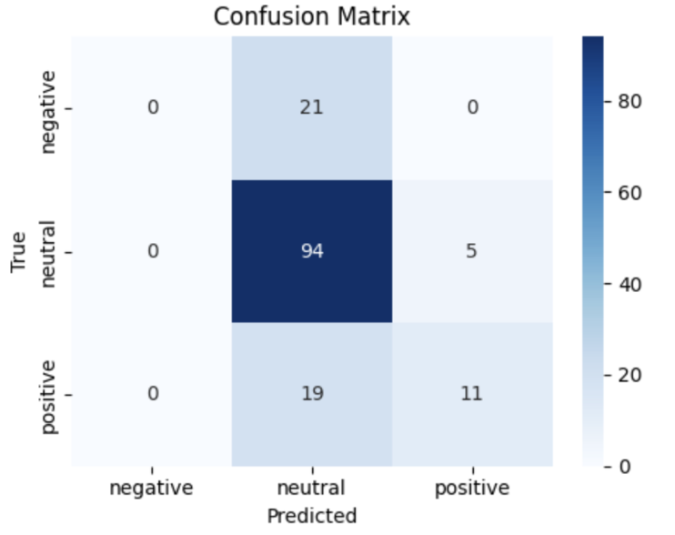

# Data Driven Education Lab 📈

## 🤝 Contributers

Saloni Agshiker, Ethan Lu, Zilu Zhu, Diya Jain, Harikesh Tambareni, Clara Murray | GT VIP Research Program 2025 - 2026

***

## 🚀 Inspiration & Goals

Student feedback is essential for higher education instructors to enable the improvement of teaching methods and course alignment. However, the primary mechanism for collecting and leveraging feedback remains protractive and passive, as instructors currently rely on end-of-semester, optional, and often incentivized CIOS surveys. COMPASS (Course Optimized Machine Powered Analysis of Student Sentiment) leverages the tools embedded in the student learning experience to reach the source of truth on student engagement, confusion, and attitude.

***

## 🎯 What it Does

COMPASS connects to online discussion forum platforms like EdDiscussion and processes, analyzes, and interprets the data to provide instructors with real-time, actionable feedback. Under the hood, a fine-tuned DistilBERT model classifies discussion forum posts by sentiment and cognitive presence using the Community of Inquiry (CoI) framework. Latent Dirichlet Allocation unsupervised modeling, TF-IDF statistical methods, and ridge regression models discover emerging topic clusters and explore the correlation between student engagement and academic performance. COMPASS is more than just a KPI-rich dashboard; it is a comprehensive, natural language-driven system that contextualizes student engagement across patterns and recommends alignment strategies. For example, seeing students cluster in the "exploration" phase without reaching "resolution" may prompt an instructor to organize a review session next class rather than a change that only benefits next semester's cohort. 

This project builds on our 3 semesters’ worth of research, product design, and implementation from the Data-Driven Education VIP, under C21U’s Dr. Lee and Dr. Yilmaz Soylu. It directly advances the Center for Teaching and Learning’s mission to promote solution-oriented, cutting-edge practices that empower instructors to make more responsive, effective, and data-informed decisions, while addressing a critical gap in the current student feedback and course-improvement cycle. To date, COMPASS’s models have been trained on data from CS 1301 O and OMS analytics courses, achieving 95.9% sentiment classification accuracy and 81.2% cognitive presence accuracy. Through the Teaching with Technology partnership, we aim to move beyond a proof of concept towards a scalable platform that can support real-time course improvement at GT. 

## 🧠 Our Models

We built two NLP models using Pandas and Gensim: (1) **Term Frequency–Inverse Document Frequency (TF-IDF)**, which represents documents as numerical vectors by weighting words based on their importance within a document relative to the full corpus, and (2) **Latent Dirichlet Allocation (LDA)**, a probabilistic topic-modeling algorithm that identifies latent topics across a collection of documents. A corpus of approximately 40,000 discussion-forum comments from Georgia Tech CS 1301 and ISYE 6501 courses was processed through the TF-IDF model to identify high-importance terms, and through the LDA model to uncover common thematic structures across the comments.

We developed a **sentiment analysis model** using DistilBERT, a lightweight, distilled version of BERT, to classify approximately 40,000 discussion-forum comments as positive, negative, or neutral. DistilBERT was selected over the standard BERT architecture due to its faster training time and improved performance on smaller, labeled datasets, while still retaining strong contextual language understanding. The model was trained on a manually annotated subset of 1,000 comments, with a 70/15/15 train–validation–test split. After training, we evaluated model performance using a confusion matrix to compute key metrics including accuracy, precision, and F1 scores, which helped identify class imbalance effects and areas for further fine-tuning. 

***

## 📽 Demo

