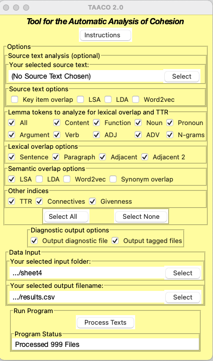

Set up the environment
======================
To successfully run this model, you are only required to set up the environment, and extracting the features through LIWC2015 and TAACO. Connecting to the DB, Named Entity Recognition, ect... is not required.

Set up the environment
======================

1. Create the environment from the ``environment.yml`` file:

        conda env create -f environment.yml

Connect to DB
=============
Data is stored in [PostgreSQL](https://www.postgresql.org/). We connect to the database through db.py using the [psycopg2](https://www.psycopg.org/) library.

1. Create a ``.credentials`` folder in ``root/``.

2. Copy and paste your credentials into ``.credentials/db_cred.txt``. It should look like this:

        Host: <url>
        Port: <number>
        Database: <name>
        User: <string> Password: <string>

Feature Extraction
==================

Named Entity Recognition
------------------------

Note that nltk.tokenize requires Java JDK. Ensure that the filepath to the java executable is correct in ``main.py``. An example of this is as follows:

        os.environ['JAVAHOME'] = '/home/david/Downloads/jdk-16/bin/java'

For additional instructions, please follow follow the [nltk documentation](http://www.nltk.org/api/nltk.tag.html#module-nltk.tag.stanford). It is likely to be necessary to convert the NER Filepath variables at the top of `main.py` to the code runs correctly.

LIWC2015
--------
Note that this application is behind a payment wall.

1. Purchase an [academic version](https://liwcsoftware.onfastspring.com/).

2. Open the application and select "Analyze Text".

3. Choose Excel/CSV file, and select the corresponing piazza data.

4. Select the column that corresponds to the text feature.

TAACO
-----

1. in `main.py` uncomment the following lines to create batch text files:

        taaco = TAACO('./.data/data.xlsx')
        taaco.convert_csv_to_text()

2. Download [TAACO](https://www.linguisticanalysistools.org/taaco.html). 

3. Run the TAACO application with the following configuration:

    

Resources
=========
1. https://nlp.stanford.edu/software/CRF-NER.shtml#Download

2. http://www.nltk.org/api/nltk.tag.html#module-nltk.tag.stanford

3. https://pythonprogramming.net/named-entity-recognition-stanford-ner-tagger/

4. https://developers.google.com/machine-learning/crash-course/representation/feature-engineering

5. https://machinelearningmastery.com/how-to-one-hot-encode-sequence-data-in-python/

6. https://stackoverflow.com/questions/37292872/how-can-i-one-hot-encode-in-python

